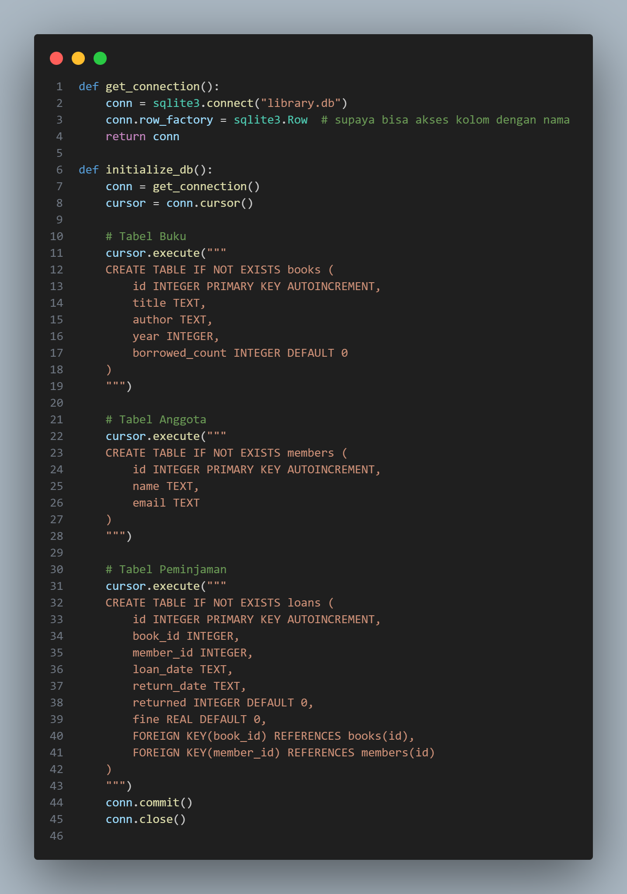
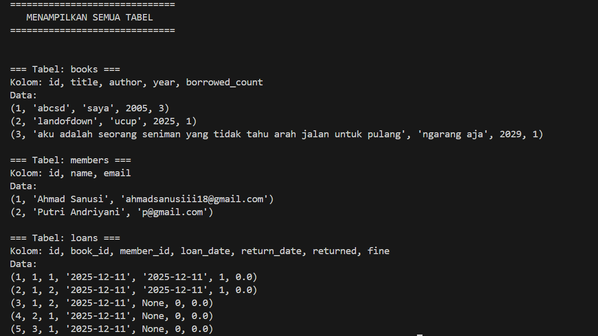
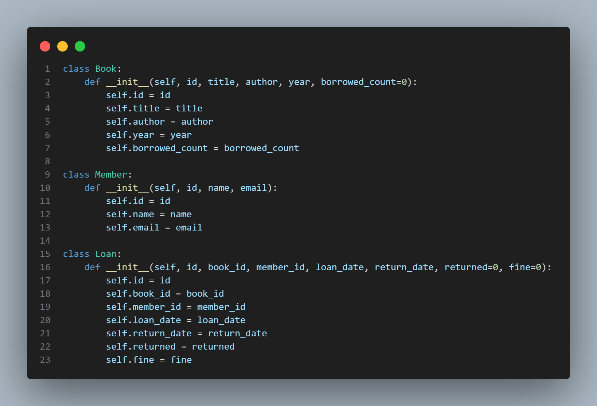
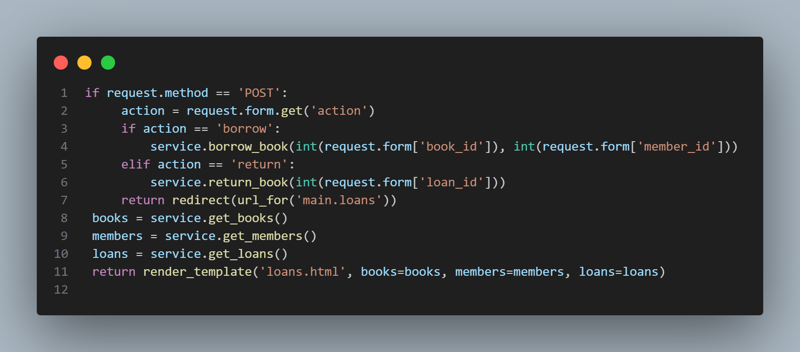
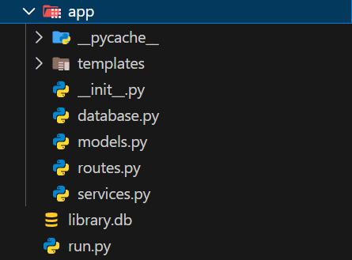

##📚 Library Management System (Python + Flask + SQLite)

Sistem Manajemen Perpustakaan berbasis Python, menggunakan Flask sebagai backend web framework, serta SQLite sebagai database.
Proyek ini dirancang memenuhi seluruh ketentuan:

✔ Menggunakan Database (SQLite)
✔ Menggunakan OOP (Object-Oriented Programming)
✔ Menggunakan Modul & Package
✔ Menggunakan Percabangan (if-else)
✔ Menggunakan Perulangan (for)
✔ Dapat dijalankan sebagai Web App

##🚀 Cara Menjalankan Proyek
1. Clone atau Download Project
git clone <repo-kamu>

2. Install Virtual Environment (Opsional)
python -m venv venv

3. Install Dependencies
pip install flask

4. Jalankan Aplikasi
python run.py

Aplikasi dapat dibuka di: http://127.0.0.1:5000

=================================
## 📸 Screenshot Aplikasi

Tampilan antarmuka Sistem Manajemen Perpustakaan:

| Screenshot | Screenshot |
|-----------|------------|
|  |  |
|  |  |
|  |  |
|  |  |

## Screenshot Struktur Database dan isi Tabel database

## Screenshot OOP 

## Screenshot Perulangan dan Percabangan 

## Screenshot Modul Package

